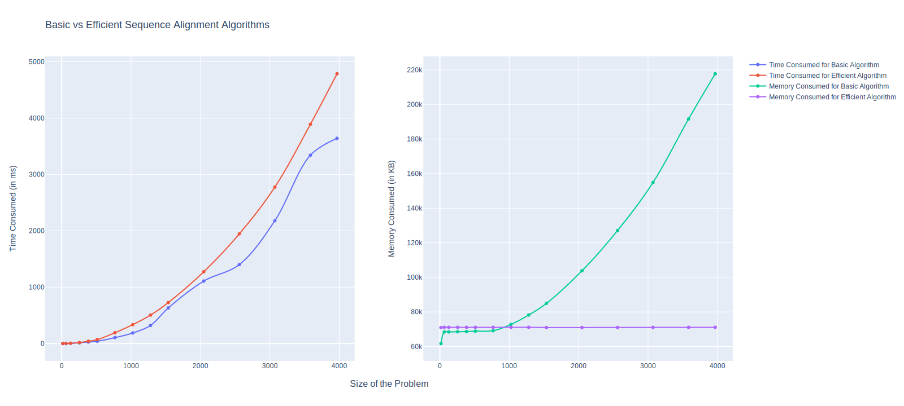

# 🧬[Bio-Informatics] Genetic Sequence Alignment Algorithm

*In bioinformatics, a sequence alignment is a way of arranging the sequences of DNA, RNA, or protein to identify regions
of similarity that may be a consequence of functional, structural, or evolutionary relationships between the
sequences. Aligned sequences of nucleotide or amino acid residues are typically represented as rows within a matrix.
Gaps are inserted between the residues so that identical or similar characters are aligned in successive columns.
Sequence alignments are also used for non-biological sequences, such as calculating the distance cost between strings in
a natural language or in financial data.*

## Deoxyribonucleic Acid [DNA]

DNA, or deoxyribonucleic acid, is the hereditary material in humans and almost all other organisms. Nearly every cell in
a person’s body has the same DNA. The information in DNA is stored as a code made up of four chemical bases: adenine (A)
, guanine (G), cytosine (C), and thymine (T). DNA bases pair up with each other, A with T and C with G, to form units
called base pairs. Each base is also attached to a sugar molecule and a phosphate molecule.

## Single Stranded DNA [ssDNA]

Single-stranded DNA is a DNA molecule that consists of only a single strand contrary to the typical two strands of
nucleotides in helical form (Double-Stranded DNA).

## Sequence Alignment for ssDNA

Suppose X and Y are two ssDNA gene sequences for which we wish to find similarity.

Our definition of similarity will be based on finding the optimal alignment
between X and Y, according to the following criteria. Suppose M is a given
alignment between X and Y.

* First, there is a parameter δ > 0 that defines a gap penalty. For each
  position of X or Y that is not matched in M—it is a gap—we incur a
  cost of δ.
* Second, for each pair of letters p, q in our alphabet, there is a mismatch
  cost of αpq for lining up p with q. Thus, for each (i, j) ∈ M, we pay the
  appropriate mismatch cost αxiyj for lining up xi with yj. One generally
  assumes that αpp = 0 for each letter p—there is no mismatch cost to line
  up a letter with another copy of itself—although this will not be necessary
  in anything that follows.
* The cost of M is the sum of its gap and mismatch costs, and we seek an
  alignment of minimum cost.

## Basic vs Efficient Algorithm

We have developed the basic algorithm for sequence alignment which runs in O(mn) time and
**O(mn)** space complexity. The basic algorithm will require a quadratic amount of memory which implies for
sequences with 100K plus chemical bases, the algorithm will require over 10 Gigabytes of memory.
For this reason, we have improvised the efficient algorithm to run in a linear **O(m+n)** space complexity,
keeping the time complexity in similar scalar range of O(mn).

## Visualizing Basic vs Efficient Algorithm

## Input / Output Files

* Present in `/resources` folder
* Output files should be generated in `/resources/output` folder according to convention

## How to run

* Install requirements
    * `python` version 3 and `pip` is necessary
    * Run following command to install dependencies
        * `pip install -r requirements.txt`
* Basic
    * `python basic.py`
* Efficient
    * `python efficient.py`
* Plotting
    * `python plotting.py`

## Generated Plots

* Plots will be stored by name `plot.png` in the folder `/images`

## TODO

* Write some info in README.md
* Complete Efficient Code for getting the final gene sequence
* Create Summary.pdf file